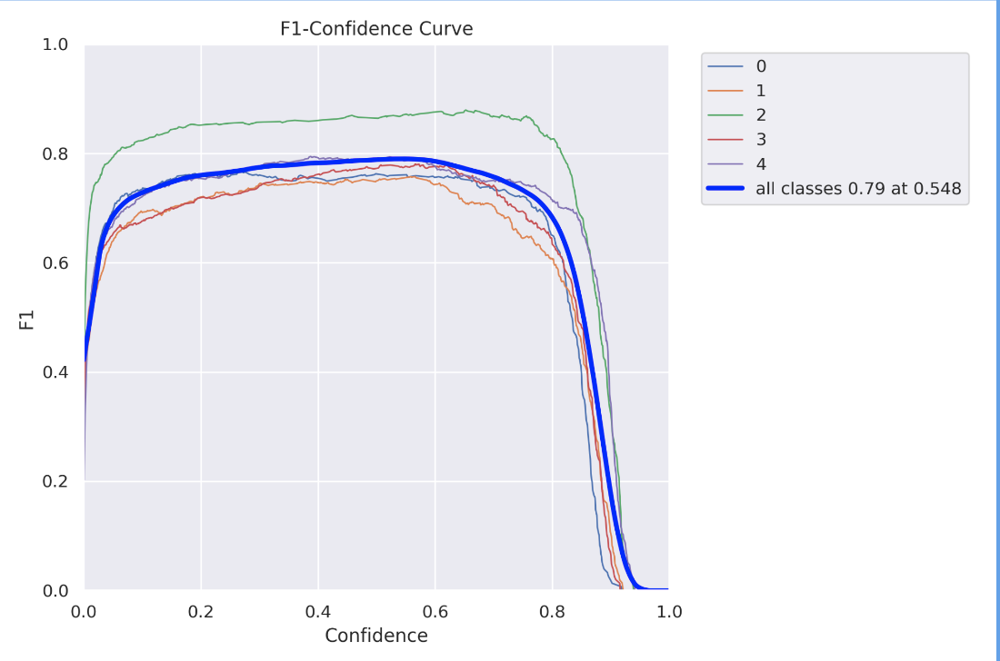

# detect-membership
Augustus Rollin &amp; Marrio Jeyakumar Science Fair project 2023

Goal Statement

Identify strangers (non-members) in a population at a specific location (campus) without the sacrifice of personal information

- CRITICAL: Facial recognition jeopardizes member privacy and therefore we have designed a solution to not use facial recognition technology.
- We perform authorization via uniform detection using a passive camera based system.

Details

- System must run in real-time.  Latency of operation is critical.
- Member quantity can be large, i.e. > 100 members in a single camera view.
- Cameras are constantly scanning the environment.

Use Cases

- Alert on presence of non-member
- Alert on uniform non-compliance
- Blur faces of members in video

